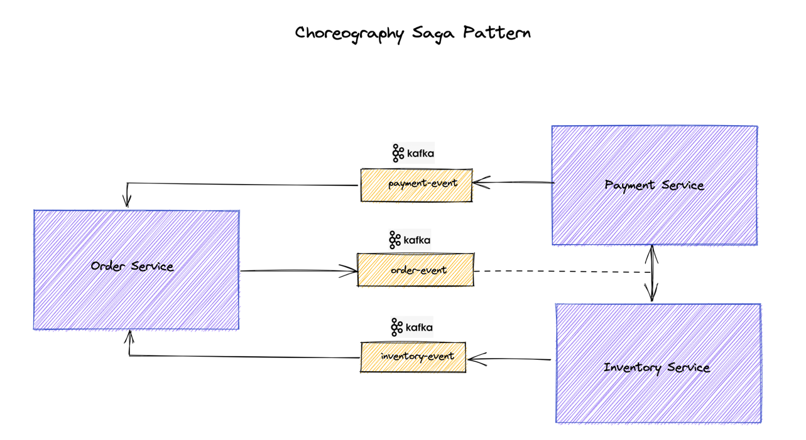
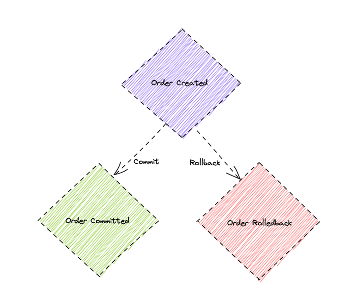

This sample project is a simple implementation of Choreography Saga Pattern with Spring Boot as described in blog post:
https://www.vinsguru.com/choreography-saga-pattern-with-spring-boot/

Committing / Rolling back a transaction which spans multiple microservices is very challenging. Each service should have the event-handlers, for committing / rolling back the transaction to maintain the data consistency, for every event it is listening to!

